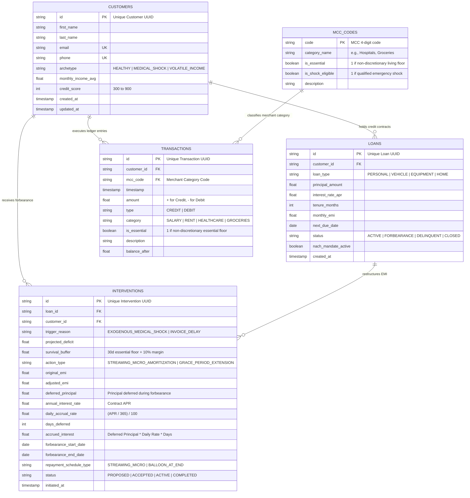

# Aegis: Dynamic Liquidity Forbearance for Transient Financial Shocks

> **Domain 3:** Preventing Financial Distress Before It Becomes a Crisis (Sponsored by Temenos)  
> **Hackathon:** Innovation Bound Hackathon — VIT Chennai  
> **Role 2:** Database Architect (Relational Schema & Rules Engine) — **Branch: Manas**

---

## 1. Problem Context & The Role of Aegis

Modern retail credit systems remain anchored to an inflexible, 19th-century primitive: **the rigid monthly lump-sum billing cycle**. Under this architecture, core banking ledgers evaluate loan repayment as a binary status, automatically executing fixed e-mandates and NACH debits on rigid calendar dates regardless of a borrower's immediate cashflow reality.

### The Core Problem
When reliable retail borrowers experience exogenous, non-discretionary life shocks—such as emergency medical expenditures or delayed commercial invoice settlements—they face **temporary illiquidity rather than permanent structural insolvency**. However, because legacy core banking software demands 100% of an EMI on a fixed calendar date against depleted funds, the scheduled debit bounces.

This automated failure triggers a cascading systemic crisis:
1. **Punitive Friction**: The institution levies immediate bounce and late fees, compounding the consumer's cash deficit.
2. **Credit Degradation**: The missed mandate automatically reports a delinquency to credit bureaus (e.g., CIBIL/Experian), dropping the borrower's score by 40 to 70 points.
3. **Predatory Debt-Stacking**: To prevent immediate escalation, the consumer turns to unregulated, high-interest digital lending apps (36%–48% APR) to cover the bank's mandate.
4. **Institutional Non-Performance**: A temporary 5-day timing mismatch is artificially converted into a toxic, unserviceable debt spiral, transforming a historically performing asset into an institutional Non-Performing Asset (NPA).

**Aegis solves this** by calculating each borrower's **Minimum Survival Buffer**, identifying early cashflow distress before default occurs, and executing automated, elastic interventions (such as streaming micro-amortization) that protect the consumer's living floor and preserve asset quality.

---

## 2. Core Relational Schema

Implemented in [`schema.sql`](schema.sql) (SQLite 3) and [`models.py`](models.py) (SQLAlchemy 2.0 ORM):



### Table Breakdown

| Table | Purpose | Key Columns & Constraints |
| :--- | :--- | :--- |
| **`customers`** | Borrower profiles, income baselines, and risk classifications | `id` (PK), `archetype` (CHECK), `monthly_income_avg`, `credit_score` (CHECK 300-900) |
| **`loans`** | Credit facilities, fixed EMI obligations, and NACH mandate statuses | `id` (PK), `customer_id` (FK), `monthly_emi`, `next_due_date`, `status` (CHECK), `nach_mandate_active` |
| **`transactions`** | Cashflow ledger tracking essential living floors and merchant types | `id` (PK), `customer_id` (FK), `mcc_code` (FK), `timestamp`, `amount`, `is_essential`, `balance_after` |
| **`mcc_codes`** | Merchant Category Code lookup table enforcing shock eligibility | `code` (PK), `category_name`, `is_essential`, `is_shock_eligible` |
| **`interventions`** | Dynamic forbearance proposals, daily interest accrual, and micro-schedules | `id` (PK), `loan_id` (FK), `customer_id` (FK), `trigger_reason`, `survival_buffer`, `deferred_principal`, `accrued_interest` |

---

## 3. Advanced Database Architecture Features

### Feature 1: Real-Time SQL View (`v_customer_risk_status`)
Instead of requiring external backend code to repeatedly execute expensive multi-table joins, the database engine maintains a real-time analytical view that calculates:
- **30-Day Essential Spending Floor**
- **Minimum Survival Buffer**
- **Financial Runway (in Days)**: How many days of essential expenses the current liquid balance covers
- **Liquidity Distress Indicator**: Automatic binary flag (`1` for Critical Distress, `0` for Healthy)
- **Projected Survival Deficit**: Exact monetary gap below the survival floor
- **Recommended Forbearance Action**: Directly mapped to borrower archetype

### Feature 2: Merchant Category Code Guardrail Table (`mcc_codes`)
Enforces the **Exogenous Shock Guardrail** at the database level. For emergency forbearance to trigger, transactions must match qualified, non-discretionary MCC codes:
- **Qualified Shock Codes**: `8062` (Hospitals & Inpatient Care), `8011` (Physicians & Urgent Clinics), `5912` (Pharmacies & Prescriptions)
- **Essential Recurring Codes**: `5411` (Groceries), `4900` (Utilities), `6513` (Residential Rent)
- **Disqualified / Non-Shock Codes**: `6012` (Financial Transfers / Self-Transfers / P2P), `7995` (Gambling), `5812` (Dining)
*This mathematically prevents users from gaming the forbearance engine with self-transfers or speculative movements.*

### Feature 3: Enhanced Interventions with Daily Interest Accrual Tracking
Provides full financial accounting for restructured loans. Rather than a simplistic status toggle, the ledger computes exact daily interest accrual on deferred principal balances:
$$\text{Daily Accrual Rate} = \frac{\text{Annual APR}}{365 \times 100}$$
$$\text{Accrued Interest} = \text{Deferred Principal} \times \text{Daily Accrual Rate} \times \text{Days Deferred}$$
Supports multiple repayment schedules: `STREAMING_MICRO` (weekly micro-installments), `BALLOON_AT_END` (grace period extension), and `TENURE_EXTENSION`.

---

## 4. Minimum Survival Buffer Rules Engine

### The Mathematical Formula

$$\text{Essential Expenses}_{30d} = \sum_{\substack{t \in \text{Debits}_{30d} \\ \text{is\_essential} = 1}} |t.\text{amount}|$$

$$\text{Minimum Survival Buffer} = \text{Essential Expenses}_{30d} \times 1.10 \quad \text{(10\% Emergency Margin)}$$

### Distress & Runway Evaluation

$$\text{Projected Post-EMI Balance} = \text{Current Liquid Balance} - \text{Upcoming Scheduled EMI}$$

$$\text{Financial Runway (Days)} = \left( \frac{\text{Current Liquid Balance}}{\text{Essential Expenses}_{30d}} \right) \times 30$$

$$\text{Distress Condition} = \text{Projected Post-EMI Balance} < \text{Minimum Survival Buffer}$$

$$\text{Projected Deficit} = \text{Minimum Survival Buffer} - \text{Projected Post-EMI Balance}$$

---

## 5. Synthetic Data Archetypes

Populated via [`seed_data.py`](seed_data.py):

| Archetype | Persona | Financial Profile | Scenario & Aegis Resolution |
| :--- | :--- | :--- | :--- |
| **1. Healthy** | **Priya Sharma** (`CUST-001`) | Income: ₹1,50,000/mo<br>Credit Score: 790<br>EMI: ₹18,500 | Balance: ₹1,77,000. Buffer: ₹50,930. Runway: 90.0 days. Projected post-EMI balance is ₹1,58,500. **Status: HEALTHY**. Standard NACH debit proceeds. |
| **2. Medical Shock** | **Arun Kumar** (`CUST-002`) | Income: ₹48,000/mo<br>Credit Score: 735<br>EMI: ₹11,800 | Suffered ₹47,000 emergency hospital bill (verified via MCC 8062/5912). Liquid balance collapsed to ₹4,200. Buffer: ₹79,200. Runway: 0.0 days. Deficit: ₹86,800.<br>**Aegis Action:** **`STREAMING_MICRO_AMORTIZATION`** (weekly micro-debits of ₹2,950; daily interest on ₹8,850 deferred principal over 30 days is ₹98.20 at 13.5% APR). |
| **3. Volatile Income** | **Rohan Verma** (`CUST-003`) | Freelancer / UI Consultant<br>Credit Score: 710<br>EMI: ₹14,500 | Delayed ₹85,000 enterprise client invoice. Current balance down to ₹8,200. Buffer: ₹33,330. Runway: 0.0 days. Deficit: ₹39,630.<br>**Aegis Action:** **`GRACE_PERIOD_EXTENSION`** (14-day shift to align with expected invoice date; daily interest on ₹14,500 over 14 days is ₹62.57 at 11.25% APR). |

---

## 6. Role 2 Deliverables & File Structure

- [`schema.sql`](schema.sql): Complete SQLite DDL schema script creating the 4 core tables, MCC reference table, constraints, indexes, and the `v_customer_risk_status` view.
- [`aegis.db`](aegis.db): Pre-populated SQLite database file containing the tables, MCC codes, and 45-day transaction ledgers.
- [`models.py`](models.py): Declarative SQLAlchemy 2.0 ORM models matching the relational schema.
- [`database.py`](database.py): Database engine and session factory with SQLite foreign key enforcement pragmas.
- [`rules_engine.py`](rules_engine.py): Core mathematical calculation functions for Minimum Survival Buffer, daily interest accrual, and MCC guardrail validation.
- [`queries.sql`](queries.sql): Standalone analytical SQL queries for calculating buffers, auditing risk views, and checking daily accruals.
- [`seed_data.py`](seed_data.py): Synthetic data population script modeling MCC codes and the 3 borrower archetypes.

---

## 7. How to Use & Query

```bash
# 1. Populate or Reset the SQLite database
python seed_data.py

# 2. Query the real-time Risk View using sqlite3 CLI
sqlite3 aegis.db "SELECT * FROM v_customer_risk_status;"

# 3. Run full analytical verification queries
sqlite3 aegis.db < queries.sql
```
