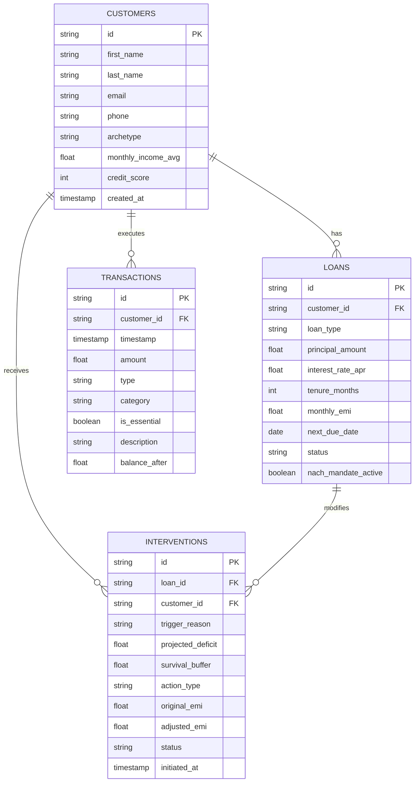

# Aegis: Dynamic Liquidity Forbearance for Transient Financial Shocks

> **Domain 3:** Preventing Financial Distress Before It Becomes a Crisis (Sponsored by Temenos)  
> **Hackathon:** Innovation Bound Hackathon — VIT Chennai

---

## 1. Problem Context & The Role of Aegis

Modern retail banking ledgers operate on a rigid, 19th-century primitive: **fixed monthly lump-sum NACH/e-mandate debits on calendar dates**. When a historically reliable borrower experiences an exogenous, transient shock (e.g. emergency surgery or delayed client invoice settlement), they face **temporary illiquidity**, not structural insolvency.

When an inflexible bank core executes a 100% debit against depleted balances:
1. **Debit Bounces**: Levies immediate punitive bounce and late fees.
2. **Credit Degradation**: Reporting a 30-day delinquency drops CIBIL/credit score by 40–70 points.
3. **Predatory Debt-Stacking**: Borrowers resort to 36%–48% APR digital payday lenders to avoid default.
4. **NPA Spiral**: A temporary 5-day liquidity mismatch is artificially converted into an unserviceable Non-Performing Asset.

**Aegis solves this** by calculating each borrower's **Minimum Survival Buffer**, predicting cashflow distress days before the debit date, and executing automated, elastic interventions (e.g., Streaming Micro-Amortization, Grace Period Extensions) accompanied by LLM-powered empathetic communication.

---

## 2. Integrated Backend Architecture

Aegis is built as a modular, fully integrated **FastAPI** backend that ties together three distinct engines:

1. **Relational Database (SQLAlchemy):** Manages user profiles, historical transactions, loans, and interventions.
2. **Machine Learning Pipeline (Scikit-Learn/IsolationForest):** Projects cashflows (30/60/90 days), detects transactional anomalies, and recommends safe debit amounts.
3. **Empathy Engine (LLM):** Translates rigid mathematical repayment plans into warm, human-readable rationales to encourage borrower consent without placing blame.

These modules are unified under the `services/logic_service.py` layer, which orchestrates data across the DB, ML pipeline, and LLM to serve the frontend via clean REST APIs.

---

## 3. Core Relational Schema

Implemented in [`schema.sql`](schema.sql) (SQLite) and [`models.py`](models.py) (SQLAlchemy 2.0 ORM):



### Minimum Survival Buffer Rules Engine

- **Essential Expenses (30d):** Sum of essential debits over the last 30 days.
- **Minimum Survival Buffer:** Essential Expenses + 10% Emergency Margin.
- **Distress Condition:** Projected Post-EMI Balance < Minimum Survival Buffer.

---

## 4. Empathy / LLM Layer

> **File:** [`aegis/backend/empathy_engine.py`](aegis/backend/empathy_engine.py)

When the rules engine and ML models classify a borrower as distressed, Aegis communicates the situation with empathy and a concrete resolution. 

The Empathy Engine is integrated directly into the `logic_service.py`. It receives a structured distress payload (shock type, amount, current balance, ML-recommended reduced EMI), constructs a tightly constrained LLM prompt, and returns a three-part human response: a headline, a two-sentence message body, and a specific action suggestion.

**Rules baked into every prompt:**
1. **No blame.** The shock is framed as an exogenous life event, not poor financial decision making.
2. **Plain explanation.** Explains why finances are under stress without jargon.
3. **Concrete suggestion.** Uses real numbers to explain the recommended reduced EMI and deferred amount.

**LLM Provider Fallback Chain:**
1. **OpenAI (`gpt-4o-mini`)** if `OPENAI_API_KEY` is present.
2. **Google Gemini (`gemini-1.5-flash`)** if `GEMINI_API_KEY` is present.
3. **Hardcoded Fallback** ensures the demo never breaks, even without API keys.

---

## 5. Machine Learning Pipeline

Located in [`aegis/backend/ML_model/`](aegis/backend/ML_model/), the ML pipeline acts as the analytical brain of the system:
- **Anomaly Detection:** Utilizes `IsolationForest` to flag unusual transaction behavior.
- **Cashflow Projection:** Time-series modeling to project balance trajectories at day 30, 60, and 90.
- **Adaptive Repayment:** Computes "Safe Debit" amounts by taking the borrower's living floor and projected cashflows into account.
- **Risk Scoring:** Generates a continuous "Financial Oxygen Score".

*Note: The ML pipeline uses its own self-contained SQLite database for transaction and feature analysis to separate analytical processing from the transactional ORM database.*

---

## 6. Project Structure

```text
Aegis/
├── aegis/
│   ├── backend/
│   │   ├── main.py                 # FastAPI application entrypoint
│   │   ├── schemas.py              # Pydantic data contracts
│   │   ├── empathy_engine.py       # LLM prompt generation
│   │   ├── requirements.txt        # Python dependencies
│   │   ├── routers/                # API Endpoints (user_router, portfolio_router)
│   │   ├── services/
│   │   │   └── logic_service.py    # Core business logic bridging DB, ML, and LLM
│   │   └── ML_model/               # Machine Learning Engine & Pipeline
│   └── frontend/                   # Frontend assets
├── database.py                     # SQLAlchemy database configuration
├── models.py                       # SQLAlchemy ORM models
├── rules_engine.py                 # Mathematical calculation for survival buffers
├── schema.sql                      # DDL schema for SQLite
└── seed_data.py                    # Script to populate the DB with synthetic archetypes
```

---

## 7. How to Setup & Run

### 1. Database Initialization
```bash
# Populate / Reset the SQLite database with borrower archetypes
python seed_data.py
```

### 2. Environment Variables
Navigate to the backend directory and set up your API keys for the Empathy Engine:
```bash
cd aegis/backend
copy .env.example .env
# Edit .env and add either OPENAI_API_KEY or GEMINI_API_KEY
```

### 3. Install Dependencies & Run the Server
```bash
# Install required packages (FastAPI, SQLAlchemy, scikit-learn, etc.)
pip install -r requirements.txt

# Start the unified backend server
uvicorn main:app --reload --port 8000
```

### 4. API Documentation
Once running, explore and test the integrated endpoints via the interactive Swagger UI:
- **Swagger UI:** `http://localhost:8000/docs`
- **ReDoc:** `http://localhost:8000/redoc`

The endpoints include:
- `GET /api/user/{id}/assessment`
- `GET /api/user/{id}/projection`
- `GET /api/user/{id}/repayment-plan`
- `GET /api/user/{id}/anomalies`
- `GET /api/portfolio/summary`
- `GET /api/portfolio/at-risk`
