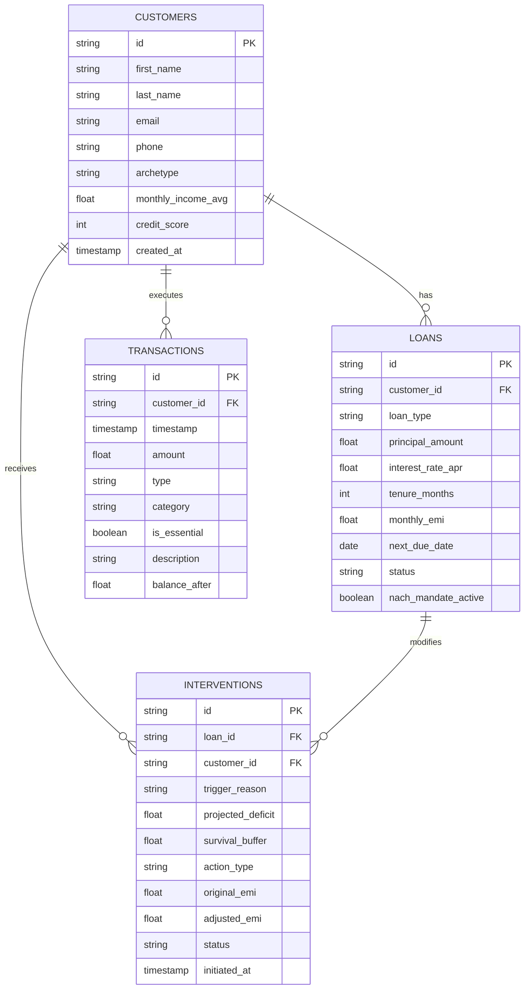

# Aegis: Dynamic Liquidity Forbearance for Transient Financial Shocks

> **Domain 3:** Preventing Financial Distress Before It Becomes a Crisis (Sponsored by Temenos)  
> **Hackathon:** Innovation Bound Hackathon — VIT Chennai

---

## 1. Problem Context & The Role of Aegis

Modern retail banking ledgers operate on a rigid, 19th-century primitive: **fixed monthly lump-sum NACH/e-mandate debits on calendar dates**. When a historically reliable borrower experiences an exogenous, transient shock (e.g. emergency surgery or delayed client invoice settlement), they face **temporary illiquidity**, not structural insolvency.

When an inflexible bank core executes a 100% debit against depleted balances:
1. **Debit Bounces**: Levies immediate punitive bounce and late fees.
2. **Credit Degradation**: Reporting a 30-day delinquency drops CIBIL/credit score by 40–70 points.
3. **Predatory Debt-Stacking**: Borrowers resort to 36%–48% APR digital payday lenders to avoid default.
4. **NPA Spiral**: A temporary 5-day liquidity mismatch is artificially converted into an unserviceable Non-Performing Asset.

**Aegis solves this** by calculating each borrower's **Minimum Survival Buffer**, predicting cashflow distress days before the debit date, and executing automated, elastic interventions (e.g., Streaming Micro-Amortization, Grace Period Extensions).

---

## 2. Core Relational Schema

Implemented in [`schema.sql`](schema.sql) (SQLite) and [`models.py`](models.py) (SQLAlchemy 2.0 ORM):



### Table Breakdown

| Table | Purpose | Key Columns |
| :--- | :--- | :--- |
| **`customers`** | Borrower profiles & income baselines | `id`, `archetype`, `monthly_income_avg`, `credit_score` |
| **`loans`** | Credit contracts & fixed repayment obligations | `id`, `customer_id`, `monthly_emi`, `next_due_date`, `status`, `nach_mandate_active` |
| **`transactions`** | Cashflow ledger tracking essential living floors | `id`, `customer_id`, `timestamp`, `amount`, `category`, `is_essential`, `balance_after` |
| **`interventions`** | Dynamic forbearance proposals preempting default | `id`, `loan_id`, `trigger_reason`, `survival_buffer`, `action_type`, `adjusted_emi`, `status` |

---

## 3. Minimum Survival Buffer Rules Engine

### The Mathematical Formula

$$\text{Essential Expenses}_{30d} = \sum_{\substack{t \in \text{Debits}_{30d} \\ \text{is\_essential} = 1}} |t.\text{amount}|$$

$$\text{Minimum Survival Buffer} = \text{Essential Expenses}_{30d} \times 1.10 \quad \text{(10\% Emergency Margin)}$$

### Distress & Deficit Evaluation

$$\text{Projected Post-EMI Balance} = \text{Current Liquid Balance} - \text{Upcoming Scheduled EMI}$$

$$\text{Distress Condition} = \text{Projected Post-EMI Balance} < \text{Minimum Survival Buffer}$$

$$\text{Projected Deficit} = \text{Minimum Survival Buffer} - \text{Projected Post-EMI Balance}$$

---

## 4. Synthetic Data Archetypes

Populated via [`seed_data.py`](seed_data.py):

| Archetype | ID | Financial Profile | Scenario & Aegis Resolution |
| :--- | :--- | :--- | :--- |
| **1. Healthy** | `CUST-001` | Income: ₹1,50,000/mo<br>Credit Score: 790<br>EMI: ₹18,500 | Balance: ₹1,77,000. Buffer: ₹50,930. Projected post-EMI balance is ₹1,58,500. **Status: HEALTHY**. No intervention needed. |
| **2. Medical Shock** | `CUST-002` | Income: ₹48,000/mo<br>Credit Score: 735<br>EMI: ₹11,800 | Suffered ₹47,000 emergency hospital expenditure 3 days before EMI. Liquid balance collapsed to ₹4,200. Buffer: ₹79,200. Binary NACH would bounce. **Aegis Action:** Preemptively replaces lump sum with **`STREAMING_MICRO_AMORTIZATION`** (weekly ₹2,950 installments) to protect living floor. |
| **3. Volatile Income** | `CUST-003` | Freelancer / UI Consultant<br>Credit Score: 710<br>EMI: ₹14,500 | Delayed ₹85,000 enterprise client invoice. Current balance dropped to ₹8,200. Buffer: ₹33,330. **Aegis Action:** Activates **`GRACE_PERIOD_EXTENSION`** shifting NACH date by 14 days without penalty or credit bureau reporting. |

---

## 5. Role 2 Deliverables & File Structure

This branch strictly contains the database architecture, relational schema, calculation engine, and synthetic data assets for **Role 2: Database Architect**:

- [`schema.sql`](schema.sql): Complete SQLite DDL schema script creating the 4 tables (`customers`, `loans`, `transactions`, `interventions`) with foreign keys, checks, and performance indexes.
- [`aegis.db`](aegis.db): Pre-populated SQLite database file containing the tables and 45-day transaction ledgers.
- [`models.py`](models.py): Declarative SQLAlchemy 2.0 ORM models for backend integration.
- [`database.py`](database.py): Database engine and session factory with SQLite foreign key enforcement pragmas.
- [`rules_engine.py`](rules_engine.py): Contains the core mathematical calculation for the **Minimum Survival Buffer** (30-day essential debits + 10% margin) and distress evaluation function.
- [`queries.sql`](queries.sql): Standalone analytical SQL queries for calculating the buffer and auditing distress.
- [`seed_data.py`](seed_data.py): Synthetic data population script modeling the 3 borrower archetypes (Healthy, Medical Shock, Volatile Income).

---

## 6. How to Use & Execute

```bash
# 1. Populate / Reset the SQLite database with 3 borrower archetypes
python seed_data.py

# 2. Inspect the database with SQLite CLI or DBeaver / GUI tool
sqlite3 aegis.db < queries.sql
```

---

## 7. Empathy / LLM Layer

> **File:** [`aegis/backend/empathy_engine.py`](aegis/backend/empathy_engine.py)  
> **Runs on:** `http://localhost:8001`

---

### 7.1 Purpose & Design Philosophy

When the rules engine classifies a borrower as distressed, the system has two choices: send a cold automated rejection, or communicate the situation with empathy and a concrete resolution. Aegis does the latter.

The Empathy Layer is a standalone FastAPI microservice responsible for generating the message a borrower reads inside their Alert Modal at the exact moment their financial stress is detected. It receives a structured distress payload from the backend, constructs a tightly constrained LLM prompt, and returns a three-part human response — a headline, a two-sentence message body, and a specific action suggestion.

The core insight this layer is built on: a borrower who just paid ₹47,000 in hospital bills does not need to be told their "account is under stress due to high expenditure." They need to be told that what happened to them is a life event, not a failure, and that the system is already adjusting to absorb the impact. The difference in language determines whether the borrower consents to the repayment plan or closes the app.

---

### 7.2 Architecture

The service is intentionally decoupled from the main backend. It runs on a separate port (`8001`) and communicates purely through HTTP. This means:

- It can be swapped from OpenAI to Gemini to any other LLM provider without touching the rest of the system.
- The main backend never blocks on LLM latency — it calls this service asynchronously.
- The fallback chain guarantees the demo always produces output, even without API keys.

```
ML Backend (distress detected)
        │
        ▼
POST /empathy  ──►  Prompt Builder
                         │
                         ▼
                    OpenAI gpt-4o-mini
                         │  (fails or no key)
                         ▼
                    Gemini 1.5 Flash
                         │  (fails or no key)
                         ▼
                    Hardcoded Fallback
                         │
                         ▼
              { headline, message, suggestion }
                         │
                         ▼
              Customer Alert Modal (Mobile UI)
```

---

### 7.3 Prompt Engineering

The prompt is the core intellectual contribution of this layer. It is not a generic "be nice" instruction — it encodes specific financial domain rules that govern how Aegis communicates a distress event.

**The three rules baked into every prompt:**

1. **No blame.** The LLM is explicitly instructed never to use language that implies the borrower made poor choices. Words like "overspent", "irresponsible", "poor financial decision" are prohibited. The shock is framed as an exogenous life event.

2. **Plain explanation.** The message must explain in simple language why the balance is under pressure right now — connecting the specific shock event to the current financial state, without jargon.

3. **Concrete suggestion.** The suggestion must use real numbers from the payload. Saying "we will help you" is not sufficient — the prompt requires the actual reduced EMI amount and the deferred amount to be stated explicitly so the borrower can make an informed decision to consent.

**Prompt structure sent to the LLM:**

```
You are a compassionate financial wellness assistant for Aegis, a lending app.

A customer named [user_name] has just experienced a financial shock.
Shock type: [shock]
Shock amount: ₹[amount]
Their current account balance is ₹[balance].
The system recommends temporarily reducing their EMI from ₹[emi] to
₹[recommended_emi] this month, deferring ₹[deferred_amount] interest-free.

Write a response with EXACTLY this structure:
1. HEADLINE: A short (max 8 words), warm, non-judgmental headline.
2. MESSAGE: Exactly 2 sentences. First: acknowledge the shock without blame.
   Second: explain why finances are under stress right now.
3. SUGGESTION: One clear, specific action sentence with the actual numbers.

Rules:
- Never use blame language.
- Be warm, human, and direct — no corporate jargon.
- Use ₹ for all amounts.
- Output using exact labels: HEADLINE: / MESSAGE: / SUGGESTION:
```

The output is then parsed by splitting on these labels, so the three fields map cleanly to the modal UI components.

---

### 7.4 LLM Provider Chain

The service tries providers in order and falls through gracefully:

| Priority | Provider | Model | Trigger |
| :--- | :--- | :--- | :--- |
| 1 | OpenAI | `gpt-4o-mini` | `OPENAI_API_KEY` is set |
| 2 | Google Gemini | `gemini-1.5-flash` | `GEMINI_API_KEY` is set |
| 3 | Hardcoded fallback | — | Neither key present |

The hardcoded fallback contains pre-written, pitch-ready responses for each shock type (`medical`, `job_loss`, `other`). They use the same three-field structure and format the real numbers from the payload at runtime using Python string formatting. The demo never breaks.

---

### 7.5 API Reference

#### `POST /empathy`

Accepts a distress payload and returns the empathy response.

**Request body:**

```json
{
  "shock": "medical",
  "amount": 47000,
  "user_name": "Arun",
  "balance": 4200,
  "emi": 11800,
  "recommended_emi": 4500,
  "deferred_amount": 7300
}
```

| Field | Type | Required | Description |
| :--- | :--- | :--- | :--- |
| `shock` | `string` | ✓ | Shock type: `medical`, `job_loss`, `other` |
| `amount` | `float` | ✓ | Shock expense in INR |
| `user_name` | `string` | | Borrower's first name for personalisation |
| `balance` | `float` | | Current account balance in INR |
| `emi` | `float` | | Current scheduled monthly EMI |
| `recommended_emi` | `float` | | ML-recommended reduced EMI for this month |
| `deferred_amount` | `float` | | Amount to be deferred interest-free |

**Response body:**

```json
{
  "headline": "You're navigating an unexpected medical storm.",
  "message": "A sudden hospital bill of ₹47,000 hit your account — this is a life event, not a financial misstep. It has temporarily strained your cash flow and brought your balance to a critical level.",
  "suggestion": "Aegis will reduce your EMI to ₹4,500 this month, deferring ₹7,300 completely interest-free until your finances stabilise."
}
```

| Field | Description | Maps to |
| :--- | :--- | :--- |
| `headline` | Short bold line, max 8 words | Modal header |
| `message` | Exactly 2 sentences, empathetic body | Modal body text |
| `suggestion` | One action sentence with real numbers | Modal CTA sub-text |

#### `GET /health`

Returns service liveness and which LLM providers are configured.

```json
{
  "status": "ok",
  "openai": true,
  "gemini": false
}
```

---

### 7.6 Supported Shock Types

| `shock` value | Scenario | Fallback tone |
| :--- | :--- | :--- |
| `medical` | Emergency hospital bill, surgery, pharmacy | Acknowledges sudden nature of health crises |
| `job_loss` | Sudden income gap, layoff, employer default | Normalises income disruption as a systemic event |
| `other` | Any other large unexpected expense | Generic but non-blaming, focuses on temporary pressure |

---

### 7.7 File Structure

```
aegis/backend/
├── empathy_engine.py      # Full service — FastAPI app, prompt builder, LLM callers, fallback
├── .env.example           # Template — copy to .env and add one API key
└── requirements.txt       # fastapi, uvicorn, httpx, pydantic, python-dotenv
```

---

### 7.8 How to Run

```bash
cd aegis/backend

# Install dependencies
pip install -r requirements.txt

# Set up environment (only ONE key needed)
copy .env.example .env
# Edit .env and add either OPENAI_API_KEY or GEMINI_API_KEY

# Start the service
uvicorn empathy_engine:app --reload --port 8001
```

To verify it is running:
```bash
curl http://localhost:8001/health
```

To test the full empathy flow without a UI:
```bash
python empathy_engine.py
```

This runs an inline `asyncio` test against the medical shock scenario and prints the three-field response to the terminal. No server required.

---

### 7.9 Integration with the Rest of the System

The empathy engine sits between the ML distress detection pipeline and the customer-facing Alert Modal:

1. The rules engine evaluates all active borrowers and flags those whose post-EMI balance will breach the Minimum Survival Buffer.
2. The backend constructs a `DistressPayload` using the borrower's balance, EMI, and shock category from the transaction ledger.
3. The backend calls `POST http://localhost:8001/empathy` with that payload.
4. The empathy engine returns `{ headline, message, suggestion }`.
5. The mobile UI displays these three fields inside the Alert Modal that the borrower sees when they open the app.
6. When the borrower taps "I Consent", the consent endpoint on the main backend (`POST /api/user/{id}/consent-repayment`) is called, the intervention is recorded, and the admin dashboard updates the borrower's status from `At-Risk` to `Default Averted`.

The empathy engine has no direct database access and no dependency on any other internal module. It is a pure input-output service — distress JSON in, human message out.
