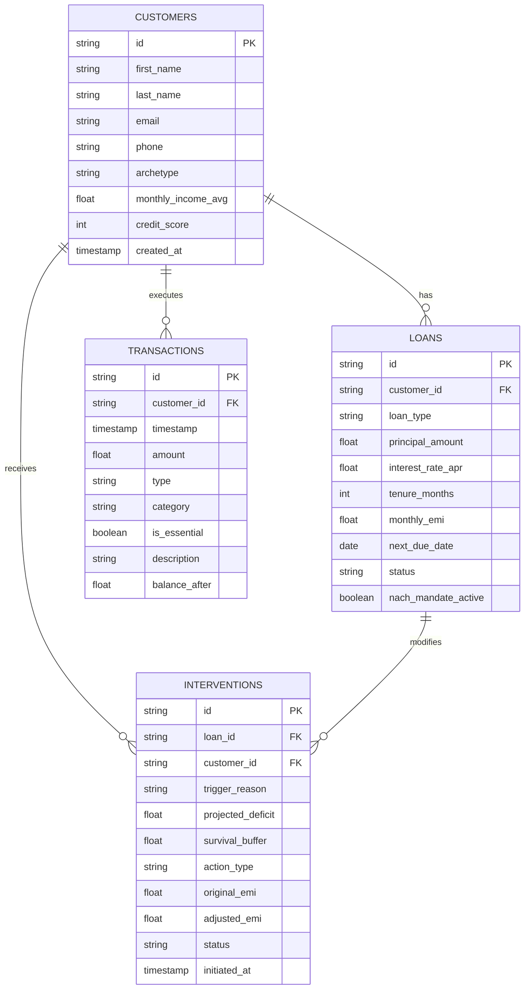

# Aegis: Dynamic Liquidity Forbearance for Transient Financial Shocks

> **Domain 3:** Preventing Financial Distress Before It Becomes a Crisis (Sponsored by Temenos)  
> **Hackathon:** Innovation Bound Hackathon — VIT Chennai  
> **Role 2:** Database Architect (Relational Schema & Rules Engine) — **Branch: Manas**

---

## 1. Problem Context & The Role of Aegis

Modern retail banking ledgers operate on a rigid, 19th-century primitive: **fixed monthly lump-sum NACH/e-mandate debits on calendar dates**. When a historically reliable borrower experiences an exogenous, transient shock (e.g. emergency surgery or delayed client invoice settlement), they face **temporary illiquidity**, not structural insolvency.

When an inflexible bank core executes a 100% debit against depleted balances:
1. **Debit Bounces**: Levies immediate punitive bounce and late fees.
2. **Credit Degradation**: Reporting a 30-day delinquency drops CIBIL/credit score by 40–70 points.
3. **Predatory Debt-Stacking**: Borrowers resort to 36%–48% APR digital payday lenders to avoid default.
4. **NPA Spiral**: A temporary 5-day liquidity mismatch is artificially converted into an unserviceable Non-Performing Asset.

**Aegis solves this** by calculating each borrower's **Minimum Survival Buffer**, predicting cashflow distress days before the debit date, and executing automated, elastic interventions (e.g., Streaming Micro-Amortization, Grace Period Extensions).

---

## 2. Core Relational Schema

Implemented in [`schema.sql`](schema.sql) (SQLite) and [`models.py`](models.py) (SQLAlchemy 2.0 ORM):



### Table Breakdown

| Table | Purpose | Key Columns |
| :--- | :--- | :--- |
| **`customers`** | Borrower profiles & income baselines | `id`, `archetype`, `monthly_income_avg`, `credit_score` |
| **`loans`** | Credit contracts & fixed repayment obligations | `id`, `customer_id`, `monthly_emi`, `next_due_date`, `status`, `nach_mandate_active` |
| **`transactions`** | Cashflow ledger tracking essential living floors | `id`, `customer_id`, `timestamp`, `amount`, `category`, `is_essential`, `balance_after` |
| **`interventions`** | Dynamic forbearance proposals preempting default | `id`, `loan_id`, `trigger_reason`, `survival_buffer`, `action_type`, `adjusted_emi`, `status` |

---

## 3. Minimum Survival Buffer Rules Engine

### The Mathematical Formula

$$\text{Essential Expenses}_{30d} = \sum_{\substack{t \in \text{Debits}_{30d} \\ \text{is\_essential} = 1}} |t.\text{amount}|$$

$$\text{Minimum Survival Buffer} = \text{Essential Expenses}_{30d} \times 1.10 \quad \text{(10\% Emergency Margin)}$$

### Distress & Deficit Evaluation

$$\text{Projected Post-EMI Balance} = \text{Current Liquid Balance} - \text{Upcoming Scheduled EMI}$$

$$\text{Distress Condition} = \text{Projected Post-EMI Balance} < \text{Minimum Survival Buffer}$$

$$\text{Projected Deficit} = \text{Minimum Survival Buffer} - \text{Projected Post-EMI Balance}$$

---

## 4. Synthetic Data Archetypes

Populated via [`seed_data.py`](seed_data.py):

| Archetype | Persona | Financial Profile | Scenario & Aegis Resolution |
| :--- | :--- | :--- | :--- |
| **1. Healthy** | **Priya Sharma** (`CUST-001`) | Income: ₹1,50,000/mo<br>Credit Score: 790<br>EMI: ₹18,500 | Balance: ₹1,77,000. Buffer: ₹50,930. Projected post-EMI balance is ₹1,58,500. **Status: HEALTHY**. No intervention needed. |
| **2. Medical Shock** | **Arun Kumar** (`CUST-002`) | Income: ₹48,000/mo<br>Credit Score: 735<br>EMI: ₹11,800 | Suffered ₹47,000 emergency hospital expenditure 3 days before EMI. Liquid balance collapsed to ₹4,200. Buffer: ₹79,200. Binary NACH would bounce. **Aegis Action:** Preemptively replaces lump sum with **`STREAMING_MICRO_AMORTIZATION`** (weekly ₹2,950 installments) to protect living floor. |
| **3. Volatile Income** | **Rohan Verma** (`CUST-003`) | Freelancer / UI Consultant<br>Credit Score: 710<br>EMI: ₹14,500 | Delayed ₹85,000 enterprise client invoice. Current balance dropped to ₹8,200. Buffer: ₹33,330. **Aegis Action:** Activates **`GRACE_PERIOD_EXTENSION`** shifting NACH date by 14 days without penalty or credit bureau reporting. |

---

## 5. Role 2 Deliverables & File Structure

This branch strictly contains the database architecture, relational schema, calculation engine, and synthetic data assets for **Role 2: Database Architect**:

- [`schema.sql`](schema.sql): Complete SQLite DDL schema script creating the 4 tables (`customers`, `loans`, `transactions`, `interventions`) with foreign keys, checks, and performance indexes.
- [`aegis.db`](aegis.db): Pre-populated SQLite database file containing the tables and 45-day transaction ledgers.
- [`models.py`](models.py): Declarative SQLAlchemy 2.0 ORM models for backend integration.
- [`database.py`](database.py): Database engine and session factory with SQLite foreign key enforcement pragmas.
- [`rules_engine.py`](rules_engine.py): Contains the core mathematical calculation for the **Minimum Survival Buffer** (30-day essential debits + 10% margin) and distress evaluation function.
- [`queries.sql`](queries.sql): Standalone analytical SQL queries for calculating the buffer and auditing distress.
- [`seed_data.py`](seed_data.py): Synthetic data population script modeling the 3 borrower archetypes (Healthy, Medical Shock, Volatile Income).

---

## 6. How to Use & Execute

```bash
# 1. Populate / Reset the SQLite database with 3 borrower archetypes
python seed_data.py

# 2. Inspect the database with SQLite CLI or DBeaver / GUI tool
sqlite3 aegis.db < queries.sql
```
